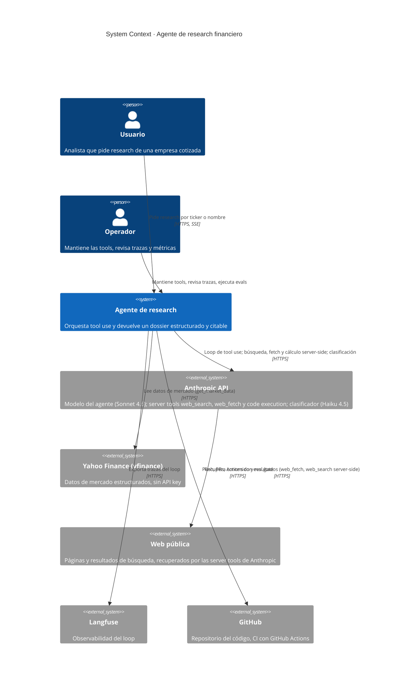

# C4 Level 1 · System Context

> Vista de máximo nivel: el agente de research financiero y los sistemas con los que interactúa.

## Diagrama

## Actores

- **Usuario:** analista que pide research de una empresa cotizada. Pasa un ticker o un nombre y recibe un dossier estructurado con datos de mercado, perfil de negocio, hechos relevantes, noticias recientes y fuentes citables. Valida y profundiza sobre el dossier, no lo construye desde cero.
- **Operador:** mantiene el sistema. Cuida las tools y sus fuentes de datos, revisa las trazas del loop en Langfuse, vigila el coste por ejecución y corre el set de evaluación cuando hay cambios.

## Sistemas externos

- **Anthropic API:** proveedor del modelo del agente (Sonnet 4.6), de las server tools `web_search`, `web_fetch` y code execution, y del clasificador de guardrails (Haiku 4.5). Es el centro del loop de tool use.
- **Yahoo Finance (yfinance):** fuente de datos de mercado estructurados que alimenta la tool `get_market_data`. Sin API key.
- **Web pública:** páginas de fuentes concretas y resultados de búsqueda que Anthropic recupera con `web_fetch` y `web_search` server-side, sin que tu backend descargue URLs (evita el SSRF de un fetch propio). Contenido externo no confiable.
- **Langfuse:** observabilidad. Recibe la traza completa de cada ejecución (tool calls, inputs, outputs, latencias, tokens, coste).
- **GitHub:** alojamiento del código y CI/CD con eval gate. Las operaciones de PR van por el `gh` CLI, no por MCP.

## Decisiones clave a nivel de sistema

- **Agente único, no varios agentes coordinándose.** Un solo loop con tools especializadas. El modelo decide qué tool usar a partir del `description` de cada una. No hay handoff entre agentes ni paralelismo de agentes.
- **Single-user y stateless por diseño.** Sin autenticación: un repo de referencia de research no la necesita. El agente no guarda histórico entre ejecuciones. Cada ejecución arranca limpia desde el ticker o nombre. Persistir un dossier vive fuera del loop.
- **Tools de solo lectura.** Las tools buscan, leen, extraen y calculan. Ninguna escribe en una base de datos, envía correo ni ejecuta acciones con efecto sobre tus sistemas. La code execution tool ejecuta Python en una sandbox efímera de Anthropic; su acotado ("no especular ni recomendar") se impone con system prompt y clasificador de output, no en el límite de la tool. La superficie de excessive agency se mantiene deliberadamente pequeña.
