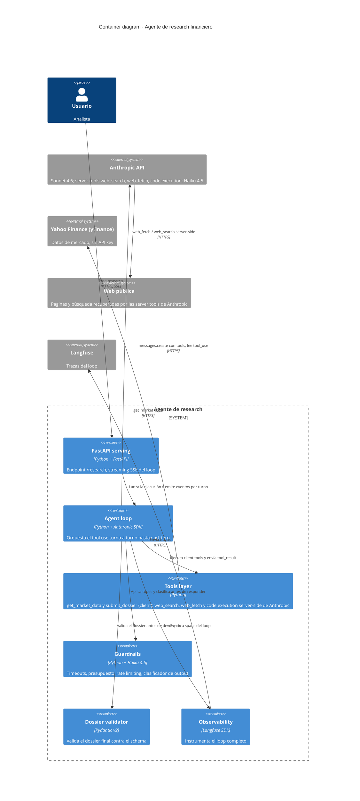

# C4 Level 2 · Containers

> Vista de los contenedores que componen el agente y cómo se comunican.

## Diagrama

## Contenedores

### FastAPI serving
- Python 3.12 con FastAPI. Expone el endpoint `/research`, que recibe un ticker o nombre de empresa.
- Devuelve eventos del loop al cliente vía `StreamingResponse` con SSE: tool invocada, resultado parcial, dossier final.
- Aplica rate limiting de entrada antes de lanzar el loop, porque cada ejecución es cara.

### Agent loop
- Construye la request a la API de Anthropic con `tools=[...]` y la lista de mensajes.
- Mientras `stop_reason == "tool_use"`, ejecuta los bloques `tool_use` (client tools en la capa de tools, server tools resueltas por Anthropic) y envía los `tool_result`.
- Lleva el contador de turnos y el contador de coste. Al llegar al tope, fuerza la respuesta final con lo recopilado.
- Marca el system prompt y las definiciones de tools como bloques cacheables.

### Tools layer
- Implementa las client tools: `get_market_data` (yfinance, sin API key) y la tool de cierre `submit_dossier`. Las server tools `web_search`, `web_fetch` y code execution corren server-side de Anthropic y no se implementan aquí; solo se declaran por tipo y versión.
- Cada client tool valida su input con Pydantic, filtra y resume el output antes de devolverlo al modelo, y devuelve los errores como parte del schema (`{"error": ..., "recoverable": ...}`) en lugar de lanzar excepción.
- `submit_dossier` recibe el `CompanyDossier` como input estructurado y señala el fin del loop.

### Guardrails
- Timeout duro por tool y reintentos con backoff exponencial para errores transitorios.
- Presupuesto de coste por ejecución: si los tokens acumulados superan el tope del ADR, corta el loop.
- Rate limiting por IP en el endpoint y respeto a los rate limits de las fuentes externas.
- Clasificador con Haiku 4.5 sobre el output del modelo para detectar respuestas que siguen instrucciones inyectadas vía contenido de tools.

### Dossier validator
- Modelo Pydantic v2 `CompanyDossier` con sus sub-schemas (`Company`, `MarketData`, `Fact`, `NewsItem`, `Source`), cada `Fact` y `NewsItem` con un `source_id` que resuelve a un `Source` real.
- Valida el output final antes de devolverlo al cliente. Si falla, pide un reintento con el error específico; si persiste, devuelve el error con el output parcial.

### Observability
- Instrumentación con el SDK de Langfuse. Cada ejecución exporta la traza completa del loop: tool calls, inputs, outputs, latencias, tokens y coste por turno.
- Es la fuente que consumen los comandos `/trace` y `/cost`.

## Relaciones principales

- El usuario habla solo con **FastAPI serving**. El resto es interno al agente.
- **Agent loop** es el orquestador: habla con Anthropic, invoca la **Tools layer**, consulta los **Guardrails** en cada turno y valida con el **Dossier validator** antes de cerrar.
- La **Tools layer** llama a Yahoo Finance (yfinance) para `get_market_data`. La web pública, la búsqueda y el cálculo los resuelve Anthropic con sus server tools (`web_fetch`, `web_search`, code execution) dentro de la llamada del loop, no tu backend.
- **Observability** recibe spans del loop y los envía a Langfuse de forma transversal.
